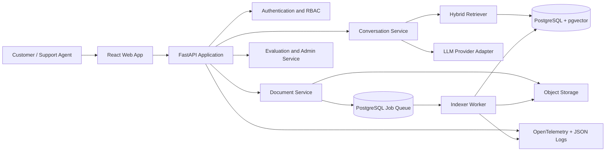

# Project Proposal: Enterprise-Style AI Customer Support Platform

**Working name:** SupportPilot  
**Purpose:** Portfolio project for AI Software Engineer roles  
**Delivery window:** 8-10 weeks, part-time  
**Target operating cost:** USD 0/month for a light public demo; about USD 3-10/month for several thousand paid-model conversations; optional paid infrastructure only when reliability is needed  
**Proposal date:** July 13, 2026

## 1. Executive summary

Build a multi-tenant customer support platform that answers questions from an organization's approved knowledge base, cites its sources, abstains when evidence is weak, and hands uncertain or sensitive requests to a human agent.

The portfolio value is not merely “a RAG chatbot.” The project should demonstrate the engineering practices used in a real product: REST APIs, authentication and authorization, tenant isolation, asynchronous document processing, prompt and model versioning, evaluation, auditability, observability, cost controls, CI/CD, migrations, security testing, deployment, and rollback.

The recommended implementation is a **modular monolith**, not microservices. One API codebase and one worker codebase share well-defined domain modules and one PostgreSQL database. This preserves enterprise-style boundaries while keeping development, hosting, and operations inexpensive. PostgreSQL also supplies full-text search, vector search through pgvector, and a durable job queue, avoiding separate Redis, message broker, and vector database bills.

This is accurately described as a **production-style portfolio platform**. It should not be presented as SOC 2 compliant, highly available, or suitable for real customer personal data unless those properties are actually implemented and verified.

## 2. Product objectives

### Primary objectives

1. Deliver trustworthy customer-support answers grounded in an approved knowledge base.
2. Show end-to-end AI application engineering rather than only model integration.
3. Demonstrate secure multi-tenancy, operational visibility, automated quality evaluation, and controlled deployment.
4. Produce honest, measurable resume evidence from evaluation and load tests.
5. Keep the architecture runnable locally and deployable at very low dollar cost.

### Target users

- **Customer:** asks questions and receives cited answers or a human-handoff response.
- **Support agent:** reviews conversations, edits draft replies, resolves escalations, and records feedback.
- **Workspace administrator:** manages members, roles, documents, prompts, model policy, budgets, and analytics.

### Portfolio success targets

These are targets to measure, not claims to place on a resume before testing.

- Retrieval Recall@5 of at least 85% on a labeled set of 100 or more questions.
- Citation correctness of at least 90% on answerable test cases.
- At least 95% correct abstention on deliberately unanswerable questions.
- Warm p95 time-to-first-token below 2.5 seconds for the demo workload.
- Fewer than 1% server errors during a documented 20-concurrent-user load test.
- Average paid-model cost below USD 0.001 per normal answer under the stated token budget.
- Automated tests proving that one workspace cannot read or retrieve another workspace's data.
- Reproducible deployment and rollback from CI/CD.

## 3. Scope

### Minimum viable product

- Email/password or OAuth login.
- Workspaces with `owner`, `admin`, `agent`, and `viewer` roles.
- Upload PDF, Markdown, text, and HTML knowledge documents.
- Asynchronous parsing, chunking, embedding, indexing, retry, and failure reporting.
- Document versioning, content hashing, re-indexing, disabling, and deletion.
- Streaming chat grounded in the active workspace knowledge base.
- Hybrid retrieval using PostgreSQL full-text search plus pgvector similarity search.
- Verifiable citations that open the source document and relevant page or section.
- Confidence policy: answer, ask a clarifying question, or abstain and escalate.
- Conversation history, ratings, feedback notes, and basic ticket handoff.
- Admin dashboard for documents, ingestion jobs, model/prompt versions, evaluation results, latency, token use, and estimated cost.
- Health checks, structured logs, metrics, traces, audit events, rate limits, and per-workspace budgets.

### Strong portfolio extensions

- OCR fallback for scanned PDFs with per-page confidence and failure review.
- Draft-reply workflow for support agents rather than only customer-facing chat.
- Tool calling for a small, safe action such as checking a synthetic order or creating a ticket.
- Human confirmation before any state-changing tool call.
- Prompt comparison and canary release between two prompt/model configurations.
- Multilingual queries and documents.
- Agent analytics: deflection rate, escalation rate, acceptance rate, answer quality, and cost by workspace.

### Explicitly out of scope for the first release

- Kubernetes, service mesh, and multiple independently deployed microservices.
- Training or fine-tuning a foundation model.
- Voice support, live telephony, and real CRM integrations.
- Autonomous refunds, account changes, or other high-impact actions.
- Claims of formal compliance, 24/7 support, disaster-recovery guarantees, or enterprise SLA.

## 4. Recommended architecture



### Architectural choices

**Modular monolith:** Domains are separate in code but shipped in one API container. A worker uses the same package and container image. This shows good boundaries without microservice overhead.

**PostgreSQL as the operational center:** Store relational data, full-text indexes, vectors, job state, audit events, prompt versions, model runs, and evaluation results in one system. pgvector supports HNSW and can be combined with PostgreSQL full-text search for hybrid retrieval ([pgvector documentation](https://github.com/pgvector/pgvector)).

**Durable database queue:** A `jobs` table with `FOR UPDATE SKIP LOCKED`, leases, idempotency keys, exponential backoff, maximum attempts, and a dead-letter state eliminates a separate Redis or broker bill. Document the point at which it should be replaced by Pub/Sub, SQS, or another managed queue.

In local development, the worker polls this table as a normal Docker Compose process. In the low-cost hosted design, the API starts a Cloud Run Job after enqueueing; the job drains a bounded batch and exits. A scheduled reconciliation run recovers jobs when dispatch fails. This preserves durable state without paying for an always-running polling worker.

**Provider abstraction:** Define small `ChatModel`, `EmbeddingModel`, and `ObjectStore` interfaces. Business logic must not import a vendor SDK directly. This enables model A/B tests, fallback, cost comparison, and migration without introducing a heavy orchestration framework.

**Tenant isolation at two levels:** Every tenant-owned row has `workspace_id`; API authorization and PostgreSQL Row Level Security both enforce it. Retrieval queries must filter by workspace before ranking.

## 5. Proposed repository structure

```text
AI_customer_support/
|-- apps/
|   |-- api/                  # FastAPI routes, middleware, dependency wiring
|   |-- web/                  # React/TypeScript customer and admin UI
|   `-- worker/               # Durable ingestion and evaluation worker
|-- packages/
|   |-- domain/               # Workspace, document, chat, ticket rules
|   |-- rag/                  # Parsing, chunking, retrieval, citations
|   |-- providers/            # LLM, embeddings, storage adapters
|   |-- observability/        # Logs, metrics, traces, cost accounting
|   `-- security/             # Authorization, redaction, audit helpers
|-- migrations/               # Alembic database migrations
|-- evals/
|   |-- datasets/             # Versioned, labeled evaluation cases
|   |-- runners/              # Retrieval and answer evaluation
|   `-- reports/              # Generated JSON/HTML summaries
|-- tests/
|   |-- unit/
|   |-- integration/
|   |-- security/
|   |-- e2e/
|   `-- load/
|-- infra/                    # Docker, deployment manifests, IaC later
|-- docs/
|   |-- architecture/
|   |-- adr/                  # Architecture Decision Records
|   |-- threat-model.md
|   |-- runbook.md
|   `-- demo-script.md
|-- .github/workflows/        # Test, scan, build, deploy, rollback
|-- compose.yaml
|-- Makefile
`-- README.md
```

## 6. Feature design

### Knowledge ingestion

1. Upload to object storage using a short-lived signed URL.
2. Create a document version and enqueue a job with an idempotency key.
3. Validate file type and size; calculate SHA-256 to detect duplicates.
4. Extract text and page/section metadata.
5. Use OCR only for pages with insufficient extracted text.
6. Normalize content, remove repeated headers/footers, and preserve citation boundaries.
7. Chunk by headings and token budget with a small overlap.
8. Generate embeddings in batches and insert them transactionally.
9. Build or update full-text and HNSW indexes.
10. Mark the document version active only after all steps succeed.

The job UI should expose `queued`, `leased`, `processing`, `retrying`, `failed`, `dead_letter`, and `completed` states. This makes failure handling visible rather than hiding it inside a notebook.

### Retrieval and answer generation

- Rewrite follow-up questions only when conversation context is required.
- Retrieve lexical and vector candidates scoped to the workspace and active document versions.
- Fuse rankings with Reciprocal Rank Fusion; keep the algorithm deterministic and testable.
- Optionally rerank only the top candidates if evaluation proves the added cost or latency worthwhile.
- Reject weak evidence using calibrated retrieval and answerability thresholds.
- Send only the minimum necessary chunks to the LLM.
- Require structured output containing answer, citations, confidence reason, and escalation decision.
- Validate every cited chunk ID against the retrieved set before returning the answer.
- Stream answer text while retaining a complete, auditable model-run record.

### Human handoff

- Trigger on low evidence, explicit user request, policy-sensitive topics, repeated dissatisfaction, or model/tool failure.
- Create a ticket containing the conversation summary, retrieved evidence, model/prompt version, and reason for escalation.
- Let an agent edit and approve a suggested reply.
- Keep the initial integration synthetic or internal; do not send real email or change real accounts in the first release.

### Administration and governance

- Workspace membership and role management.
- Per-workspace document, request, token, and cost quotas.
- Prompt registry with immutable versions, owner, change note, and activation date.
- Model configuration registry with provider, model ID/snapshot, parameters, and price metadata.
- Feature flags for OCR, reranking, model fallback, and agent tools.
- Append-only audit log for login, membership, document, prompt, model, budget, and tool-action changes.
- Data retention settings and a tested deletion workflow.

## 7. Tools and technologies

| Area | Recommended choice | Why it fits this project |
|---|---|---|
| Backend | Python 3.12, FastAPI, Pydantic, SQLAlchemy 2 | Strong AI ecosystem, typed contracts, async APIs, OpenAPI generation |
| Database | PostgreSQL 16+ with pgvector | Relational, vector, full-text, queue, audit, and analytics in one low-cost system |
| Migrations | Alembic | Reproducible schema changes and rollback discipline |
| PDF/text | pypdf first; Tesseract OCR fallback | Lightweight normal path and free OCR for scanned pages |
| Embeddings | FastEmbed/ONNX with `BAAI/bge-small-en-v1.5` | Local CPU embedding, MIT-licensed model, no per-token bill; switch to multilingual model if required |
| Frontend | React, TypeScript, Vite, TanStack Query, Tailwind CSS | Fast development, typed API consumption, easy static hosting |
| API contract | OpenAPI-generated TypeScript client | Prevents frontend/backend contract drift |
| Tests | pytest, Testcontainers, Playwright, Schemathesis, k6 | Unit, real-database integration, browser, API contract, and load coverage |
| Quality/security | Ruff, mypy, ESLint, Semgrep, Trivy, Dependabot | Cheap automated enforcement in CI |
| Observability | JSON logs, OpenTelemetry traces/metrics, Prometheus-compatible endpoint | Vendor-neutral telemetry; Python traces and metrics are stable in OpenTelemetry ([official documentation](https://opentelemetry.io/docs/languages/python/)) |
| Local development | Docker Compose | One-command reproducible environment |
| CI/CD | GitHub Actions | Standard runners are free for public repositories ([GitHub documentation](https://docs.github.com/en/billing/concepts/product-billing/github-actions)) |
| Cloud API | Google Cloud Run, minimum instances = 0 | Container deployment, scale-to-zero, and a monthly compute free tier ([pricing](https://cloud.google.com/run/pricing), [scaling behavior](https://docs.cloud.google.com/run/docs/overview/what-is-cloud-run)) |
| Managed data option | Supabase Free for Postgres, auth, and storage | One service supplies 500 MB database, 1 GB file storage, and 50,000 MAU, but free projects may pause after inactivity ([pricing](https://supabase.com/pricing)) |

Avoid adding LangChain or another large agent framework at the start. Direct provider clients plus small interfaces make retrieval, prompts, retries, token accounting, and evaluation easier to explain in an interview. Add a framework later only if a concrete feature justifies it.

Keep the initial hosted dataset below roughly 10,000 chunks and measure the real table and HNSW index sizes. This gives the 500 MB free database a safety margin for relational data, indexes, job history, audit events, and evaluation results instead of assuming the vector table is the only storage consumer.

## 8. Model strategy

### Default generation model

Use **Gemini 2.5 Flash-Lite** for the first deployed demo. It is a stable, cost-focused model with a free tier; paid standard pricing is USD 0.10 per million text/image/video input tokens and USD 0.40 per million output tokens as of the proposal date ([official pricing](https://ai.google.dev/gemini-api/docs/pricing)).

The free tier may use submitted content to improve Google's products, while the paid tier says it does not. Therefore:

- Use only synthetic, public, or non-sensitive documents on the free tier.
- Use paid processing and review the provider's terms before handling any real customer content.
- Store provider and model version with every model run.

### Comparison/fallback model

Use **OpenAI GPT-5.4 nano** for controlled evaluation or fallback, not for every request initially. Its listed price is USD 0.20 per million input tokens, USD 0.02 per million cached input tokens, and USD 1.25 per million output tokens ([official model page](https://developers.openai.com/api/docs/models/gpt-5.4-nano)). It supports streaming, function calling, structured outputs, and snapshot pinning.

### Embedding model

Start with local **BAAI/bge-small-en-v1.5** through ONNX/FastEmbed to eliminate a recurring embedding bill. The model is MIT licensed. If container size or cold-start performance is poor, use **OpenAI text-embedding-3-small** as the operational fallback; its price is USD 0.02 per million tokens, so indexing one million document tokens costs about two cents ([official model page](https://developers.openai.com/api/docs/models/text-embedding-3-small)).

Do not choose a reranker by reputation alone. First measure hybrid retrieval. Add a local cross-encoder only if it produces a meaningful Recall@k or citation improvement within the latency budget.

### Routing policy

- No LLM for authentication, database lookups, document status, or deterministic FAQs.
- Small default model for normal grounded answers, query classification, and summarization.
- Escalate to the comparison model only for explicitly measured hard cases.
- Abstain rather than escalate model size when the knowledge base lacks evidence.
- Cap input chunks, output tokens, retries, and per-workspace daily spend.

## 9. Cost plan

### Light portfolio demo

| Component | Expected monthly cost | Constraint |
|---|---:|---|
| Static frontend | USD 0 | Free static-hosting allowance |
| Cloud Run API and indexing jobs | USD 0 | Scale API to zero; run bounded jobs; remain inside compute and egress free tiers |
| Supabase database/auth/storage | USD 0 | 500 MB DB, 1 GB files; inactivity pause and no production SLA |
| Gemini API | USD 0 | Free-tier limits; synthetic/public data only |
| Local embeddings | USD 0 | CPU time and larger container/cold start |
| GitHub Actions | USD 0 | Public repository and standard runners |
| Domain | Optional, roughly USD 10-20/year | Use platform subdomains for a strict USD 0 setup |

**Expected total: USD 0/month** at light demo usage, accepting cold starts, service limits, and possible database pause.

### Paid-model usage example

Assume 5,000 conversations per month, with an average 4,000 input tokens and 500 output tokens per conversation:

- Input: 20 million tokens x USD 0.10/million = USD 2.00.
- Output: 2.5 million tokens x USD 0.40/million = USD 1.00.
- Estimated Gemini 2.5 Flash-Lite model cost: **USD 3.00/month**.

Infrastructure could still remain in free allowances. Set provider and cloud billing alerts at USD 1, USD 5, and USD 10, plus hard application quotas. Pricing and free tiers change, so keep prices in configuration and re-check official pages before deployment.

### When to pay

- Pay for the model tier before processing non-public content.
- Pay for a database plan only when an always-available recruiter demo or real backup retention is worth the fixed fee.
- Add a minimum Cloud Run instance only when measured cold-start latency justifies its continuous cost.
- Do not pay for a separate vector database, Redis, Kubernetes, or commercial observability platform until measured scale requires it.

## 10. Evaluation plan

Create a versioned dataset with at least 100 labeled questions covering:

- Direct answer in one chunk.
- Answer requiring two chunks.
- Lexical keyword match.
- Semantic paraphrase.
- Ambiguous question requiring clarification.
- Unanswerable question requiring abstention.
- Conflicting or superseded document versions.
- Prompt injection inside a retrieved document.
- Cross-workspace leakage attempt.
- OCR-derived content.

### Retrieval metrics

- Recall@k, Mean Reciprocal Rank, and nDCG.
- Retrieval latency and number of candidates.
- Performance by document type, question type, and workspace.

### Answer metrics

- Answer correctness using human labels.
- Citation correctness and citation completeness.
- Groundedness: every factual claim must be supported by cited evidence.
- Appropriate abstention and escalation.
- Helpfulness rating and support-agent acceptance rate.
- Time-to-first-token, total latency, input/output tokens, and estimated cost.

Use an LLM judge only as one signal. Version the judge prompt/model, sample failures for human review, and never present judge scores as objective truth. Run the fixed evaluation suite on every prompt, model, chunking, or retrieval change and block deployment on material regression.

## 11. Security and reliability requirements

- Threat model before tool calling or public deployment.
- PostgreSQL RLS plus application authorization for defense in depth.
- Signed upload URLs, file type/size limits, malware scanning hook, and content hash.
- Treat uploaded and retrieved text as untrusted data, never as system instructions.
- Allowlisted tools with typed arguments, least-privilege credentials, and human confirmation for writes.
- Secrets only in a secret manager or deployment environment, never repository or logs.
- PII redaction before telemetry; avoid storing raw prompts in general application logs.
- Encryption in transit and provider-managed encryption at rest.
- Rate limits by IP, user, and workspace; request timeouts and maximum body sizes.
- Idempotency keys for uploads, tickets, and tool actions.
- Bounded retries with jitter, leases, dead-letter jobs, and a replay command.
- Database backup/restore procedure appropriate to the selected plan and a documented recovery test.
- Dependency pinning, image scanning, signed releases where practical, and automated vulnerability alerts.
- Health, readiness, and dependency checks; graceful shutdown for leased jobs.

## 12. Principal risks and mitigations

| Risk | Likely failure | Mitigation and evidence to collect |
|---|---|---|
| Hallucination | Fluent unsupported answer | Citation-required output, evidence threshold, abstention policy, groundedness tests |
| Retrieval miss | Relevant passage never reaches model | Hybrid search, RRF, metadata filters, chunk experiments, Recall@k dashboard |
| Tenant data leak | Wrong workspace appears in retrieval | RLS, workspace filter before ranking, adversarial integration tests |
| Prompt injection in documents | Retrieved text redirects model or tools | Mark context as untrusted, isolate instructions, allowlist tools, human approval |
| Duplicate/out-of-order jobs | Repeated chunks or stale version becomes active | Content hash, idempotency key, leases, transactional activation, version checks |
| Scanned/complex PDFs | Empty or disordered extracted text | Page-level quality check, OCR fallback, visible failure state, manual review |
| Free-tier cold start/pause | Recruiter sees slow or unavailable demo | Fast startup, readiness page, warm it before a demo, pay only during interview periods |
| Provider limit/outage | Chat fails or retries create high cost | Timeouts, capped retries, circuit breaker, fallback provider, user-visible handoff |
| Cost runaway | Long context, loops, or abuse | Token budgets, top-k limits, quotas, caching, per-run accounting, billing alerts |
| Evaluation overfitting | Attractive score but poor real behavior | Holdout set, failure taxonomy, human review, versioned datasets |
| Model/version drift | Behavior changes without code change | Pin stable model/snapshot, store version on each run, regression gate |
| Sensitive data exposure | Prompts or logs reveal PII | Synthetic demo data, paid provider terms for real data, redaction and retention controls |
| “Enterprise” overclaim | Architecture is mistaken for compliance | Call it production-style; document missing SLA, DR, certification, and support controls |

## 13. Delivery roadmap

### Week 1: Foundation

- Architecture decisions, threat model, repository, Docker Compose, CI, linting, tests.
- Database schema, migrations, workspace model, authentication, RBAC, RLS.

### Week 2: Document lifecycle

- Upload, object storage, versioning, content hashing, job queue, worker, retry UI.

### Week 3: RAG baseline

- Parsing, chunking, embeddings, pgvector, full-text search, RRF, citations.
- First 50-question evaluation set.

### Week 4: Customer and agent experience

- Streaming chat, conversation history, abstention, feedback, ticket handoff.

### Week 5: Quality system

- Evaluation runner, datasets, regression report, prompt/model registry, cost accounting.

### Week 6: Operations and security

- OpenTelemetry, dashboards, audit log, rate limits, redaction, security and isolation tests.

### Week 7: Delivery

- Cloud deployment, CI/CD, preview environment, migration checks, rollback, backup/restore exercise.

### Week 8: Evidence and presentation

- Load tests, final evaluation, architecture diagrams, ADRs, runbook, demo video, resume bullets.

### Weeks 9-10: Optional differentiation

- OCR fallback, one safe tool workflow with human approval, multilingual evaluation, or model A/B canary.

## 14. Portfolio deliverables

- Public repository with clear commit history and tagged releases.
- Hosted demo using synthetic support documents and synthetic customer data.
- Three-minute product video and a 15-20 minute technical walkthrough.
- README with problem, architecture, quick start, screenshots, cost table, measured results, and limitations.
- Architecture diagram, schema diagram, threat model, three or more ADRs, runbook, and rollback instructions.
- Versioned evaluation dataset and generated report.
- Load-test script and reproducible results.
- CI badges for tests, security scan, container build, and deployment.
- Public issue backlog showing product-style prioritization and trade-offs.

### Honest resume bullet template

Replace bracketed values only with measured results:

> Designed and deployed a multi-tenant AI customer support platform using FastAPI, PostgreSQL/pgvector, hybrid retrieval, and a durable asynchronous ingestion pipeline; achieved [Recall@5] on [N] labeled queries, [citation correctness] grounded answers, p95 latency of [X], and average model cost of [Y] per conversation, with RLS isolation tests, OpenTelemetry observability, and automated CI/CD rollback.

## 15. Recommended first release decision

Build the first release with **FastAPI + React + PostgreSQL/pgvector + PostgreSQL job queue + Gemini 2.5 Flash-Lite + local BGE embeddings + Docker Compose + GitHub Actions + Cloud Run**. Use Supabase only as the managed Postgres/auth/storage convenience layer for the hosted demo, while keeping interfaces portable.

The most important differentiators are the evaluation suite, tenant-isolation tests, durable ingestion workflow, cost dashboard, prompt/model versioning, and documented failure handling. These provide stronger hiring evidence than adding more agent tools or infrastructure services.
