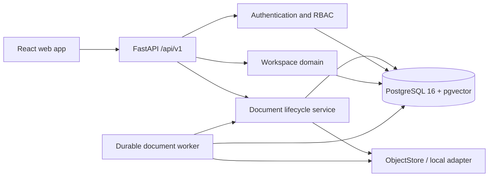

# Architecture overview

SupportPilot is a modular monolith. The API and worker are separate processes that share domain packages, one PostgreSQL database, and an application-owned object-storage boundary. Every public HTTP contract is versioned under `/api/v1`.

The current architecture decisions and the required format for future decisions are indexed in [the ADR directory](../adr/README.md). PostgreSQL and pgvector are selected as the primary operational and retrieval store in [ADR 0005](../adr/0005-postgresql-and-pgvector.md); cost is a benefit, while transaction consistency, relational integrity, tenant enforcement, and operational simplicity are the primary reasons.

The database uses separate migration and application roles. Tenant context is set with transaction-local PostgreSQL settings, and RLS policies constrain tenant-owned tables. Future document, job, conversation, and evaluation tables must use the same `workspace_id` and RLS convention.

The Week 2 document, storage, and worker boundaries are fixed in [ADR 0004](../adr/0004-document-lifecycle-and-durable-jobs.md). Logical documents point to immutable versions, while a worker activates a version only after verifying its stored object. Domain services store application-owned object keys and durable job identifiers; vendor storage responses and process-local task state do not cross those boundaries.

The local worker claims bounded job batches with PostgreSQL leases and `FOR UPDATE SKIP LOCKED`. Queue discovery uses a transaction-local worker context; each processing transaction then sets the authoritative workspace from the claimed job before touching documents or versions. A dedicated worker database credential remains a future hardening improvement.
