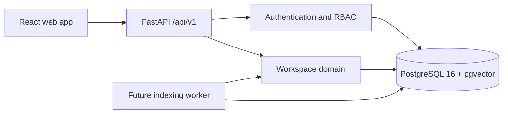

# Architecture overview

SupportPilot is a modular monolith. The API and future worker are separate processes that share domain packages and one PostgreSQL database. Every public HTTP contract is versioned under `/api/v1`.

The database uses separate migration and application roles. Tenant context is set with transaction-local PostgreSQL settings, and RLS policies constrain tenant-owned tables. Future document, job, conversation, and evaluation tables must use the same `workspace_id` and RLS convention.

The Week 2 document, storage, and worker boundaries are fixed in [ADR 0004](../adr/0004-document-lifecycle-and-durable-jobs.md). Domain services store application-owned object keys and durable job identifiers; vendor storage responses and process-local task state do not cross those boundaries.
